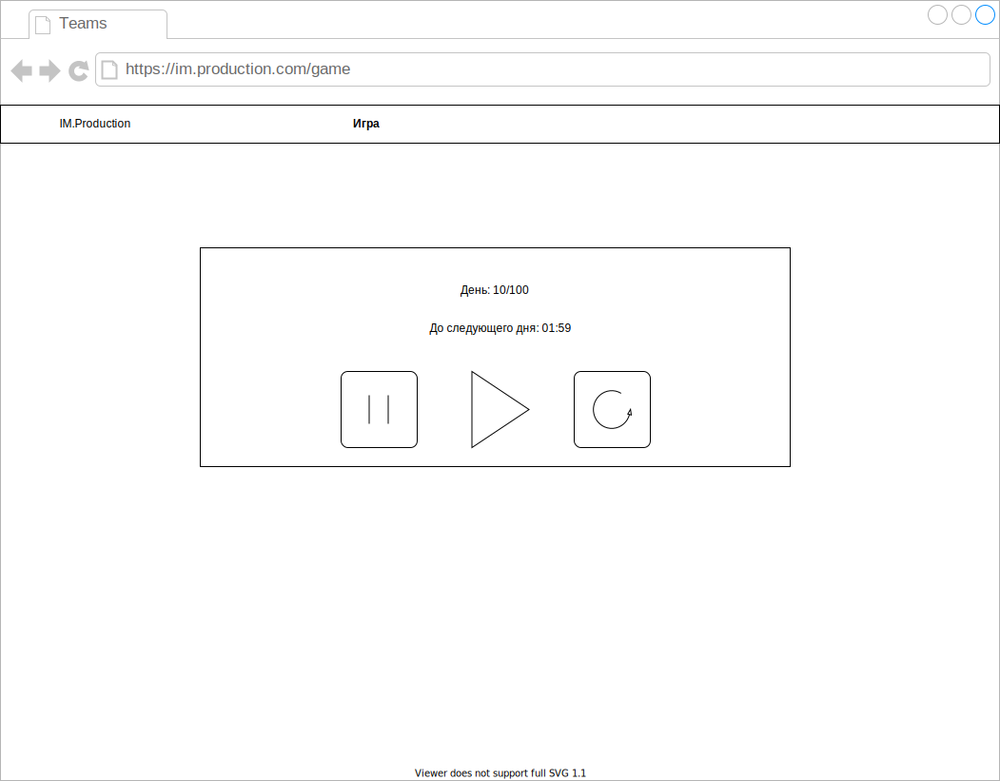
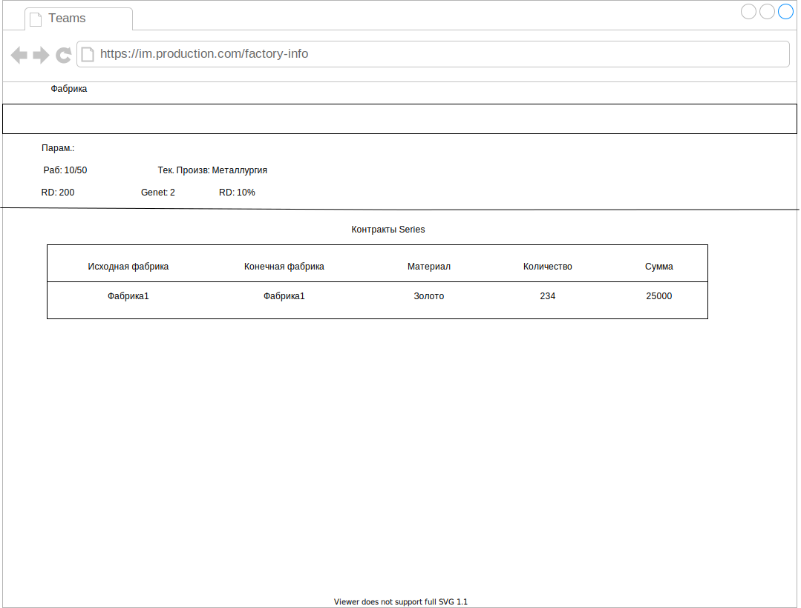
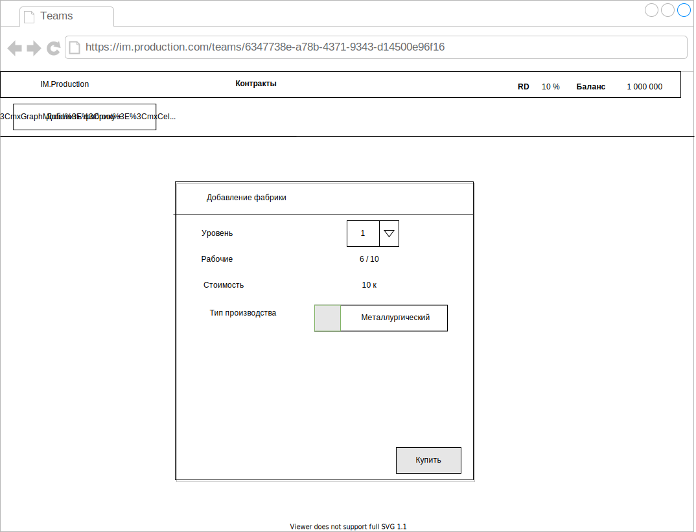
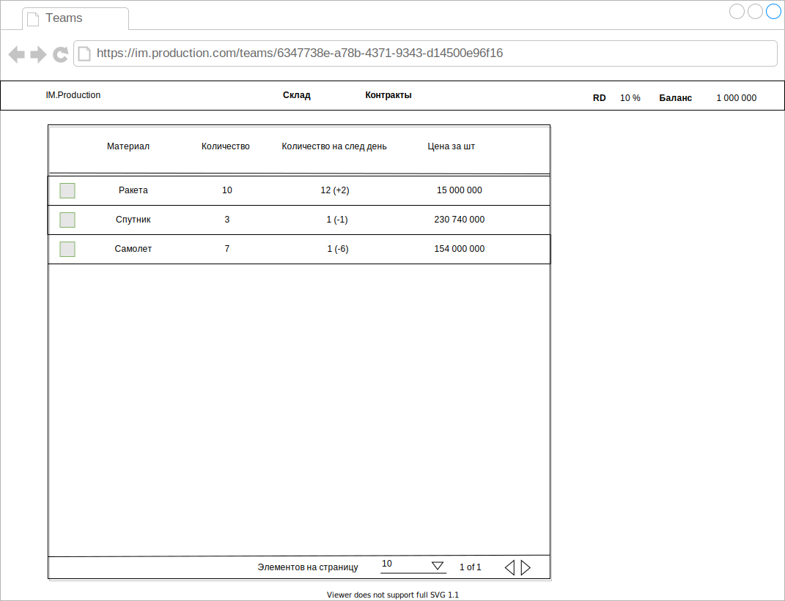

# Макеты страниц IM.Production
Представленные ниже макеты визуализируют основные страницы IM.Production.

## Команды

[Редактировать](https://www.draw.io/?mode=github#Hyafarkin%2Fim.production%2Fmockups-folder%2Fdocs%2Fmockups%2FTeams.svg)

## Игра

[Редактировать](https://www.draw.io/#Hyafarkin%2Fim.production%2Fmockups-folder%2Fdocs%2Fmockups%2FGame.svg)

## Новая Команда

[Редактировать](https://www.draw.io/?mode=github#Hyafarkin%2Fim.production%2Fmockups-folder%2Fdocs%2Fmockups%2FNewTeam.svg)

## Команда

[Редактировать](https://www.draw.io/#Hyafarkin%2Fim.production%2Fmockups-folder%2Fdocs%2Fmockups%2FTeam.svg)

## Информация о фабрике

[Редактировать](https://www.draw.io/#Hyafarkin%2Fim.production%2Fmockups-folder%2Fdocs%2Fmockups%2FFactoryInfo.svg)

## Покупка фабрики  

[Редактировать](https://www.draw.io/#Hyafarkin%2Fim.production%2Fmockups-folder%2Fdocs%2Fmockups%2FBuyFactory.svg)

## Склад

[Редактировать](https://www.draw.io/#Hyafarkin%2Fim.production%2Fmockups-folder%2Fdocs%2Fmockups%2FWarehouse.svg)
